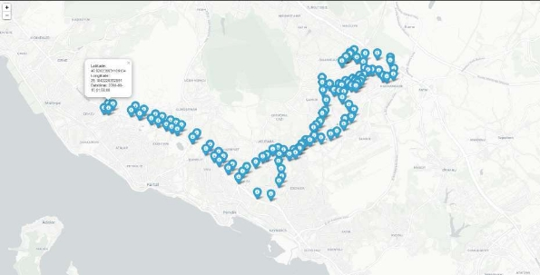
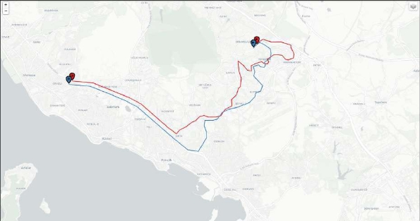

# Proje

**Kocaeli Üniversitesi Bilgisayar Mühendisliği Bölümü**

**Yazılım Laboratuvarı II Proje 1 Son Teslim Tarihi : 18 Mart 2022**

1 Mart 2022

**İçindekiler**

1. [Amaç](#_page1_x74.41_y237.20)
1. [Senaryo](#_page1_x74.41_y486.16)
1. [Kabuller](#_page2_x74.41_y70.16)
1. [Görev](#_page2_x74.41_y143.71)
1. [Kısıtlar ve Kolaylıklar](#_page2_x74.41_y596.01)
1. [Sistem Mimarisi](#_page3_x74.41_y454.48)
1. [Kullanılacak Veri](#_page3_x74.41_y621.74)
1. [Kullanıcı Senaryoları (Use Case)](#_page6_x74.41_y261.44)
    1. [Müşterinin Araçlarını Takip Etmesi](#_page6_x74.41_y326.46)
        1. [Tanım](#_page6_x74.41_y352.74)
        1. [Aktörler](#_page6_x74.41_y417.61)
        1. [Kabuller](#_page6_x74.41_y495.51)
        1. [Ön Koşullar](#_page6_x74.41_y579.97)
        1. [Normal Akış](#_page6_x74.41_y645.45)
        1. [Altenatif Akışlar](#_page8_x74.41_y70.16)
    1. [Sisteme araç verinin girişi ve işlenmesi](#_page8_x74.41_y186.75)
        1. [Tanım](#_page8_x74.41_y213.03)
        1. [Aktörler](#_page8_x74.41_y265.78)
        1. [Ön koşullar](#_page8_x74.41_y319.68)
        1. [Normal Akış](#_page8_x74.41_y401.39)
        1. [Altenatif Akışlar ](#_page8_x74.41_y70.16)
1. [Taslak Arayüzler](#_page8_x74.41_y558.71)
1. [Başarı Kriteri ve Notlandırma](#_page10_x74.41_y70.16)
1. [Proje Teslimi](#_page11_x74.41_y70.16)
1. [KAYNAKÇA](#_page11_x74.41_y337.98)

**1 Amaç**

Yazılım Laboratuvarı 2 dersi projesi kapsamında çok katmanlı bir web uygulaması geliş- tirilecektir. Bu proje ile öğrencilerimizin aşağıdaki hususlarda gerçek dünya ihtiyaçlarını dikkate alan, uygulama yeteneği kazandırılması hedeflenmektedir.

- Model, Manzara/Arayüz ve Yönetim (Model,View,Controller) kalıbının kullanıl- ması (Arayüz, İşlem Mantığı ve Verinin ayrıştırılması)
- Mesaj simsarı kullanarak yazılım fonksiyonel bölümleri arasındaki bağımlılıkların azaltıması
- Dağıtık bir sistem mimari kullanarak çözüm oluşturma
- Güncel bir web kütüphane, alt yapısının kullanımının öğrenilmesi ve uygulanması
- Değişik tipte veri tabanlarını kullanma ve veri tabanı tasarımı

**2 Senaryo**

Araç takip hizmeti vermek isteyen bir A firması, müşterilerine araçlarına takabilecekleri GPS destekli bir takip donanımı ve ilgili hizmetleri ücret karşılığı sunmak istemedir. Anılan takip donanım üzerinde GSM modülü bulunmakta olup, araçların mevkileri GSM üzerinden, A firmasının sunucularına aktarılacaktır. A firması, müşterilerine web arayüzü ve mobil uygulamalar üzerinden, ödeme planına göre, değişik güncelleme seviyelerinde, araçların mevki bilgilerini sunucaktır. A firması ilgili donanımı hazır ticari ürün olarak temin edecektir. Ancak A firmasının dağıtık bir sistem kurma ve ilgili servisleri hazırlama ihtiyacı bulunmaktadır. A firmasının yerel bir teknik alt yapı işletmek istemediğinden oluşturulacak çözüm bulut hizmetleri üzerinde kullanılabilir olması gerekmektedir.

Siz A firmasının teknik çözüm ortağı B firmasını temsil ediyorsunuz. A firmasının ih- tiyaçları kapsamında, ilgili sistem çözümünü, aşağıda verilen temel ihtiyaçlar ve tasarım kısıtları kapsımında oluşturmakla ve demosunu yapmakla görevlisiniz.

**3 Kabuller**

- Araçlardan gelecek verinin GSM alt yapısı ve ilgili operatarün sağladığı hizmetler kapsamından Bölüm-7kısmında anlatılan formatta ulaştırıldığı kabul edilecektir.

**4 Görev**

Temel fonksiyonel isterler:

1. Birden fazla kaynaktan (araçlardan) akan GPS verileri alınarak bir veri tabanı- na depolanacaktır. Verilerin alınması için bir mesaj simsarcısı (message broker) kullanılacaktır. *Bu proje kapsamında Apache Kafka vb. büyük veri ortamları için hazırlanmış ağır ürünler yerine ZeroMQ*[^1][``*veya](#_page2_x84.37_y667.38) *benzeri hafif bir yazılımın seçilmesi tavsiye edilir.*
1. Gelen anlık veriler bir NoSQL veri tabanına depolanacaktır. *Bu maksatla örneğin Redis* [^2]*kullanılabilir.*
1. Müşteri hesap bilgileri bir SQL veri tabanında tutulacaktır. SQL veri tabanı My- SQL, Postgre SQL gibi bir veritabanı sunucusu olabileceği gibi, proje kapsamında sqlite[^3]gibi gömülü sistemler için tasarlanmış basit bir veri tabanı da olabilir.
1. Gelen anlık araç bilgileri harita alt yapısının olduğu bir web arayüzünde aşağıda belirtildiği gibi sergilenecektir. Google api kullanılabileceği gibi uygun bir coğrafi bilgi sistemi hizmeti de kullanılabilir.
1. Müşteri kendisine verilen hesap bilgileri kapsamında sisteme giriş yapabilecektir.
1. Her müşteriye sahibi olduğu veya hizmetini aldığı araçların anlık veya en son mevki bilgisi gelen güncellemeler kapsamında, **harita altlığı üzerinde** sunulacaktır.
1. Araçları geçmiş mevki bilgileri, müşteri tarafından verilen zaman aralığı kapsamın- da, veri tabanından çekilerek çekilerek sergilenecektir. Hiç bir şey belirtilmemiş ise en son yarım saatlik mevki bilgileri her bir araç için sergilenecektir.
1. Müşteri bir aracı seçip, 1-24 saat arasında bir seçim yaparak, sadece o araca yönelik geçmiş güzergahı sergileyebilecektir.

**5 Kısıtlar ve Kolaylıklar**

Çözümün oluşturulmasında aşağıdaki kısıtlara dikkat edilecektir.

1. Tüm kullanılacak yazılımsal araçlar ve uygulamalar (kütüphaneler, veri tabanları, mesaj simsarı vs.) açık kaynak kodlu olacaktır. Buradaki amaç; sektörde geniş bir kullanımı bulunan açık kaynak kodlu yazılım ve araçların kullanımına ve yöneti- mine alışmanızdır.
1. Kullanılacak araçlar konusunda tavsiye olarak verilen araçların kullanımı şart de- ğildir. Kullanımı tasviye edilen uygulamalar, genel olarak kurulum ve yönetimi nispeten kolay olduğu değerlendirilen uygulamalardır. Verilen tavsiyeler projeyi zamanında bitirebilmeniz içindir. Belirtilen mimariye uygun olacak şekilde, mi- mariye ve amaca uygun aşina olduğunuz veya öğrenmek istediğiniz farklı araçları kullanılabilirsiniz.
1. Yazılımsal araçların (veri tabanı, mesaj broker vb), kolay kulumu veya yönetimi için Docker [^4] gibi container veya sanallaştırma teknolojilerinden yararlanabilirsiniz.
1. Uygulanalabilecek sistem mimarisi Bölüm-6[’de](#_page3_x74.41_y454.48) belirtilmiştir. Söz konusu sistem mimarisi, her ne kadar bulut ortamına aktarılabilecek, modüler dağıtık yapıya uygun olarak tasarlanmış ise de, tek bir bilgisayar üzerinde geliştirilmesi, sunumu ve demosu mümkündür. Teslim edilecek kaynak kodda söz konusu ayrım veya modülerlik demonun bir parçası olarak sunulacaktır ve notlandırılacaktır.
1. Proje kapsamında İsveç taksi verisi kullanılacaktır. Detaylı bilgi Bölüm-7 [kısmında](#_page3_x74.41_y621.74)belirtilmiştir.
1. Kullanılacak programlama dili veya dilleri konusunda bır kısıtlama getirilmemiştir. Öğrenciler java,python, php, ruby, go, rust, c++, javascript vb. dilleri ve uygun bir web kütüphanesini kullanarak projeyi yapabilir.

**6 Sistem Mimarisi**

Öngörülen sistem mimarileri Şekil-1[,2](#_page4_x74.41_y62.93)[’de](#_page5_x74.41_y62.93) gösterilmiştir. İki alternatif sunulmuştur. Da- ha kapsamlı mimariler oluşturulabilir. Gerçek ortamlarda Arayüz, Model, Yönetim gibi fonsiyonel gruplar ideal olarak bağımsız olarak geliştirilir, çoğu zaman farklı fiziksel maki- nalar üzerinde ve yedekli olarak çalıştırılır. Birbirlerinin hizmetlerin iyi tanımlı arayüzler üzerinden ulaşırlar. Genelde ileşimleri dahi bir mesaj simsarcısı üzerinden gerçekleştirilir. Ancak notlandırmada buna dikkat edilmeyecektir. Proje kapsamında sistem mimarisinde belirtildiği gibi Mesaj Simsarcısı sadece gelen anlık araç bilgilerinin sistem modüllerine dağıtımı için kullanılmasına bakılacaktır.

**7 Kullanılacak Veri**

Proje kapsamında isveç taksi verisi [1[\] ](#_page11_x74.41_y372.99)kullanılacaktır. Söz konusu taksi verisinde yaklaşık 100 civarında taksinin bir aylık verileri bulunmaktadır. Genel olarak veriler 1dk. aralıklar

Şekil1:SistemMimarisi-1

Şekil2:SistemMimarisi-2

ile kayıt edilmiştir. Ancak gerçek veriler olması nedeni ile, kayıt hatası, gönderim hatası vs. nedenler ile hatalı veriler güzergah içinde çıkabilmektedir. Mesala bazen veride 1dk. yüzlerce millik bir atlama yapıp geri dönmektedir. Bazen 1dk. süreler daha saatlik sürele- re dönüşmektedir. Bu tür atlamaları veya bariz hatalı kısımları veriyi inceleyip, önceden temizleyebilirsiniz veya hız/mesafe vb. değişik kriterler koyarak çalışma esnasında veri- yi silebilirsiniz. Gerçek verilerde bu tür hatalar, mesleki yaşamınızda karşılacağınız ve çözüm bulmanız gereken meselelerdir. Diğer taraftan projenin süre kısıtı nedeni, hatalı veriye karşı gerçek zamanlı bir dayanıklılık beklenmemektedir. Notlandırmada bu hususa dikkat edilmeyecektir. Önceden seçtiğiniz araç verilerin gözden geçirmeniz, düzeltmeniz veya temizlemeniz tavsiye olunur.

**Proje kapsamında iki farklı müşteri ve her müşteri için iki araç, yani en az 4 farklı araç verisini söz konusu veriden çıkararak kullanabilirsiniz.**

**8 Kullanıcı Senaryoları (Use Case)**

Aşağıda notlandırmaya temel olacak bazı temel kullanıcı senaryoları sunulmuştur.

1. **Müşterinin Araçlarını Takip Etmesi**
1. **Tanım**

Müşterinin web sitesine giriş yapmasını ve sahibi olduğu araçların mevkilerini görmesini tanımlar

2. **Aktörler**

**Birincil Aktör:** Nihai müşteri

**İkincil Aktörler:** Sistem modülleri

3. **Kabuller**

Müşteri Hesabı bu proje kapsamında önceden açılmış olacak ve bilgileri SQL veri taba- nında bulunacaktır. Hesap yönetimi vb. hususlar için ek arayüz/kabiliyetler geliştirilme- sine gerek yoktur. Sadece var olan bilgileri sorgulayan bir giriş sayfası geliştirilecektir.

4. **Ön Koşullar**

Bölüm-[6](#_page3_x74.41_y454.48)’de belirtilen tüm sistem alt modülleri ayakta, birbirleri ile iletişim halinde ve hizmete hazır durumdadır.

5. **Normal Akış**
1. Müşteri internet gezgini üzerinde A şirkeninin araç takip hizmeti bağlantısını girer veya daha önceden kayıt edilmiş bir sayfa işaretcisini tıklar.
2. Arayüz modülü ana giriş sayfasını üreterek bir kullanıcı adı ve şifre giriş alanının bulunduğu giriş sayfasını müşteriye sergiler.
2. Müşteri daha önceden açılmış olan hesabı kapsamında kendisine verilen kullanıcı adı ve şifre bilgilerini girer.
2. Arayüz modülü, girilen bilgileri Yönetim/Model modülüne gönderir, Yönetim/Model modülü kullanıcı bilgilerini doğrular.
2. Yönetim/Model modülü tarafından müşterinin sistem giriş zamanı SQL veri taba- nın kayıt edilir. (Analitik, muhasebe vb. ihtiyaçlar nedeni ile)
2. Yönetim/Model modülü kullanıcı hesabına göre araç bilgilerin ve her bir araç için son 30dk. verileri hazırlayarak Arayüz modülüne gönderir. Son 30dk veriler perfor- mans açısından Arayüz modülü tarafından NoSQL veritabanından direk çekilebilir.
2. Arayüz modülü müşterinin sahip olduğu araçlara yönelik güncel durumları ve 30dk.lık geçmiş bilgileri ile gösterir.
2. Yönetim modülü müşteri otorumunun açıklığını takip eder ve oturum açık kaldığı sürece 30dk bilgileri ve son mevkileri günceller, güncelletir. **Performans veya gerçekleştirme kolaylığı için arayüz modülü anlık veriyi mesaj brokerdan direk alabilir.**
2. Müşteri ekranda bir liste vb. kabiliyet üzerinde gösterilen araç listesinden bir aracı seçerek çift tıklar.
2. Arayüz modülü zaman aralığı bilgilerinin seçilmesini gösterecek bir dialog sunar. Arayüz dialog bitiş zamanını otomatik doldurur. Başlangıç zaman varsayılan ola- rak bir saat öncesi girilir. Bilgilerin müşterinin değiştirilmesine olanak tanınır.
2. Müşteri seçtiği araç için zaman aralığını girer ve giriş tuşuna basar veya varsayılanı onaylar.
2. Arayüz modülü girilen bilgileri Yönetim/Model modülüne gönderir, Yönetim/Modülü girilen zaman aralığına karşılık gelen bilgileri çıkarıp Arayüz modülüne gönderir.
2. Arayüz modülü gerekli sergilemeyi sağlar. Bu sayfa açık kaldığı sürece araç bilgi- lerine güncelleme yapılmaz ve sadece sorgulanan araç bilgisi gösterilir.
2. Müşteri çıkış linkine tıklayarak sistemden çıkar. Müşteri otorumu sona erer.
2. Yönetim/Model tarafından müşterinin çıkış zamanları veri tabına kayıt edilir.
6. **Altenatif Akışlar** Normal Akış Madde-[4](#_page7_x74.41_y142.85)
1. Müşteri bilgileri hatılıdır.
1. Sistem üç defaya kadar müşteriyi doğrulmaya çalışır. Üç defadan fazla hatalı gi- rişte, doğrulamayı bir diyaloğ ile bırakır.
2. **Sisteme araç verinin girişi ve işlenmesi**
1. **Tanım**

Bu senaryo verinin sisteme girişini ve sistem içinde işlenmesine yönelik akışı ifade eder.

2. **Aktörler**

**Birincil Aktör:** Yönetim/Model Modüleri ve Mesaj Simsarcısı

3. **Ön koşullar**

\1. Sistem modülleri ayakta ve hizmete hazırdır, modüller birbiri ile ileşim halinder- dir. GSM operatör alt yapısı araç verileri mesaj simsarcınını bulunduğu internet adresine yönlendirilmektedir.

4. **Normal Akış**
1. Araç verisi mesaj simsarına ulaşır.
1. Mesaj simsarı söz konusu veriyi abone olan modüllere aktarır. (Yönetici/Model, Arayüz)
1. Yönetici/Model veriyi alarak, nosql veritabına depolar.
1. Yönetici/Model gelen veriyi etkileyen bir sorgu var ise, model sorgunun cevabını güncelleyerek Yönetimci/Arayüze güncel bilgiyi gönderir.

**9 Taslak Arayüzler**

Fikir vermesi açısında Şekil-[3,figure-sample-plotting-2’de](#_page9_x74.41_y90.98) örnek plotlamalar gösterilmiş- tir. Plotlar araçların id’leri ile markalanmalıdır.

Şekil 3: Örnek bir güzergah plotlama - 1

Şekil 4: Örnek bir güzergah plotlama - 2

**10 Başarı Kriteri ve Notlandırma**

- Minimum değerlendirme koşulu, bir müşteriye ait bir araç verisinin anlık olarak veri tabanında depolanması ve web arayüzünde sergilenmesi, gelen güncellenme- lerin web arayüzünde gösterilebilmesidir. Bu kabiliyeti sergilemeyen projeler “0” (Sıfır) alacaktır.
- 100 tam puan: Aşağıdaki kriterlerin karşılanması kapsamında verilecektir.

1. Şekil-[6](#_page3_x74.41_y454.48)’de belirtilen alt yapının veya belirtilen esneklikler kapsamın muadili- nin gerçekleştirilmesi
1. Harita alt yapısını kullanılması/sergilenmesi
1. Kullanıcı Senaryosu [8.1](#_page6_x74.41_y326.46) demosunun yapılması
1. 2 müşteri için iki aracın bilgilerinin aynı anda gerçek zamanlı sergilenmesi
1. Kaynak kodun modüllerliği/esnekliği açıklanması sağladığının gösterilmesi
1. Raporun teslim edilmesi

- Değerlendirmeye alınan projelerde, verilen isterlere uygunsuzluk ölçüsünde tam nottan puan düşülecektir. Genel presipler aşağıda belirtilmiştir.

1. Mimariye uygunsuzluk/modüler mimari kullanılmaması (monolitik uygula- ma): -10
1. NoSQL veri tabanı kullanılmaması: -10
1. SQL veri tabanı kullanılmaması: -10
1. Mesaj simsarcısı kullanılmaması: -10
1. Harita altlığının sergilenememesi: -10
1. Giriş ekranı (kullanıcı adı, şifre) ve giriş ile ilgili kullanıcı senaryosundaki belirtilen fonksiyonları yerine getirmemesi: -10

- Hatalı şifre girişi fonksiyoları : -5
- Girişin ve çıkışın veri tabanına kayıt edilmemesi: -5

7. İki farklı hesaba ait araç bilgilerini eş zamanlı güncellendiğinin gösterileme- mesi: -20

- Bir hesaba yönelik iki araç izinin birlikte gösterilememesi: -10

8. Modüler olmayan, özensiz spagetti kaynak kod: -10
8. Rapor teslim edilmemesi: -10
8. Yukarıda belirtilen sınırlar dahilinde, her bir özellik için takdir yetkisi kulla- nılacaktır.

**11 Proje Teslimi**

- Rapor IEEE formatında (önceki yıllarda verilen formatta) 4 sayfa, akış diyagramı veya yalancı kod içeren, özet, giriş, yöntem, deneysel sonuçlar, sonuç ve kaynakça bölümünden oluşmalıdır.
- Dersin takibi projenin teslimi dahil edestek.kocaeli.edu.tr sistemi üzerinden yapı- lacaktır. edestek.kocaeli.edu.tr sitesinde belirtilen tarihten sonra getirilen projeler kabul edilmeyecektir.
- Proje ile ilgili sorular edestek.kocaeli.edu.tr sitesindeki forum üzerinden Arş.Gör. Muhammet Ahmet Demirtaş veya Arş.Gör. Yılmaz Dikilitaş’a sorulabilir.
- Sunum tarihleri daha sonra duyurulacaktır.
- Sunum sırasında algoritma, geliştirdiğiniz kodun çeşitli kısımlarının ne amaçla ya- zıldığı ve geliştirme ortamı hakkında sorular sorulabilir.
- Kullandığınız herhangi bir satır kodu açıklamanız istenebilir.

**12 KAYNAKÇA**

[1] *taxiMovementConcatenated | Kaggle*. url: [https://www.kaggle.com/henrikengd ahl/taximovementconcatenated.](https://www.kaggle.com/henrikengdahl/taximovementconcatenated)
12

[^1]: https://zeromq.org/
[^2]: https://redis.io/
[^3]: https://sqlite.org/index.html
[^4]: https://hub.docker.com
